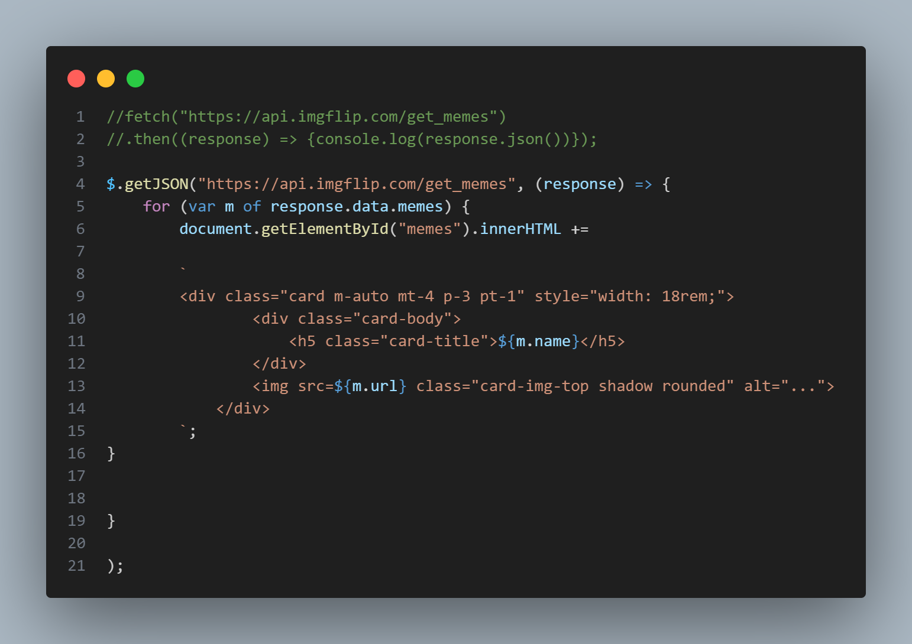
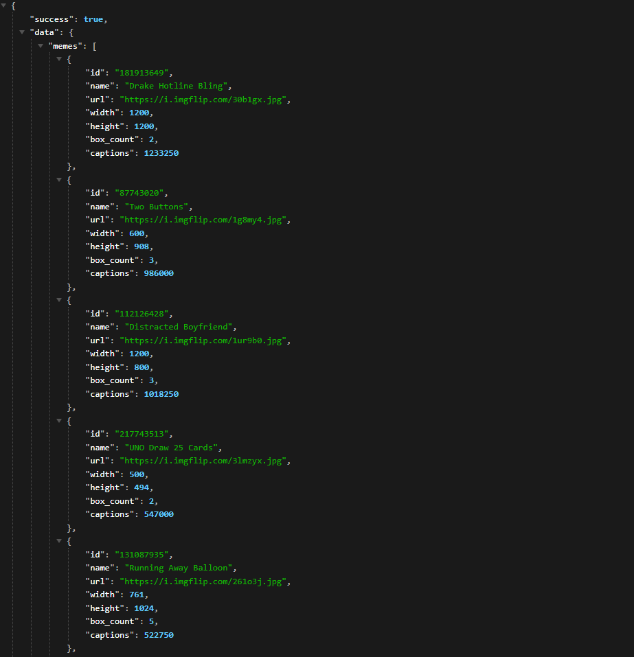

# Projeto Memes

## Descrição

Este projeto é um site simples de memes, desenvolvido em HTML, CSS e JavaScript. O site consome dados do backend por meio de um arquivo JSON para exibir os memes na página.

## Funcionalidades

- Exibição de memes populares em uma página inicial.
- Possibilidade de visualizar memes individuais em páginas separadas.
- Design responsivo para uma experiência de usuário otimizada em dispositivos móveis e desktops.

## Como Usar

1. Clone o repositório para sua máquina local.
2. Execute um servidor local, como o Live Server do Visual Studio Code, para visualizar o site.
3. Navegue pelo site para ver os memes disponíveis.

## Tecnologias Utilizadas

- HTML5
- CSS3
- JavaScript (ES6+)
- JSON para consumo de dados do backend

## Capturas de Tela

